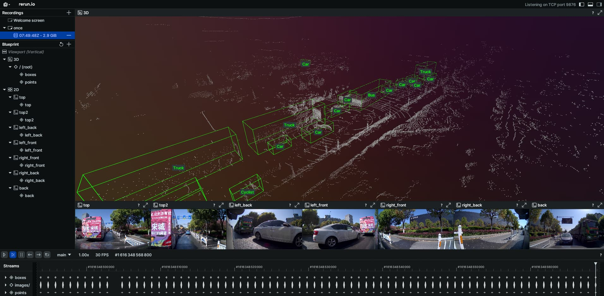

# ONCE Devkit


The [ONCE](https://once-for-auto-driving.github.io/) dataset is a large-scale autonomous driving dataset with 2D&3D object annotations.


- 1 Million LiDAR frames, 7 Million camera images
- 200km driving regions, 144 driving hours
- 15k fully annotated scenes with 5 classes (Car, Bus, Truck, Pedestrian, Cyclist)
- Diverse environments (day/night, sunny/rainy, urban/suburban areas)

This repository contains the tools to parse and visualize the dataset.

## Installation
To install the ONCE package, run the following command:
```bash
pip install once
```

## Usage
```python
from once import ONCE

# Init dataset
dataset_root = "path/to/dataset"
splits = ["train", "val", "test"]
dataset = ONCE(dataset_root, splits)

# Setup data source
seq_id = list(dataset.train_split_list)[0]
frame_id = list(dataset.train_info[seq_id].keys())[0]
img_name = dataset.camera_names[0]

# Annotaitons
annos = dataset.get_frame_anno(seq_ids, frame_id)

# Point cloud
points = dataset.load_point_cloud(seq_id, frame_id)

# Image
dataset.load_image(seq_id, frame_id, img_name)
```

See `tests/visualize.py` for visualization examples.

## Development
To build this package:
```bash
hatch build
```
